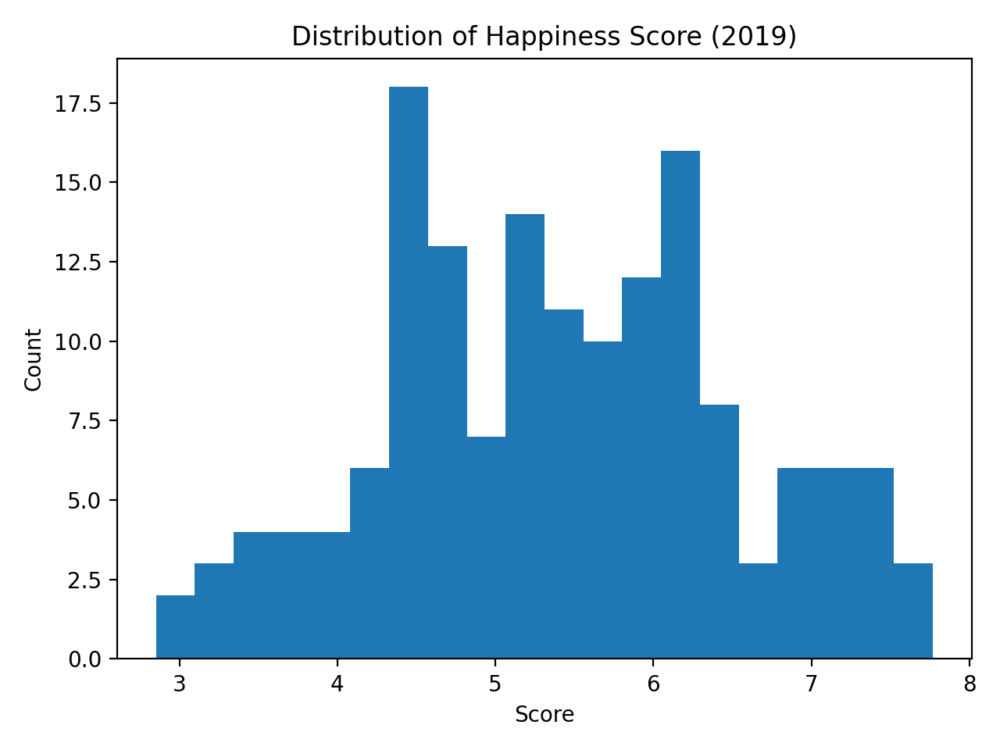

# Stakeholder Report — World Happiness 2019 Analysis

## Stakeholders
This report is intended for:
- **Policy Makers**: To guide decisions on social investment and development priorities.  
- **International Organizations (e.g., UN, WHO, World Bank):** To align global programs with drivers of well-being.  
- **Academics & Researchers:** To evaluate the validity of happiness measures and socio-economic determinants.  
- **Public Stakeholders & NGOs:** To ensure transparency and support fairness in the interpretation of results.  

---

## Executive Summary
This report examines the World Happiness Report 2019 dataset to support data-driven decision-making.  
Key findings:
- Mean global happiness score is **5.407 (95% CI: 5.235–5.583)**.
- GDP per capita, social support, and healthy life expectancy show the strongest associations with happiness.
- Fairness checks reveal disparities: highest vs lowest GDP quartiles differ by ~**2.495 points** in average score; corruption tertiles differ by **0.810**.
- Results remain robust across multiple sensitivity tests.

**Recommendations (risk-tiered):**
- **Operational (low risk):** Continue monitoring top drivers of happiness (GDP, social support, healthy life expectancy).  
- **Investigatory (medium risk):** Investigate countries underperforming relative to GDP expectations and explore outliers with high corruption perceptions but low happiness.  
- **High-stakes (high risk):** Avoid policy changes based solely on these correlations; commission longitudinal, multi-year studies before major interventions.

---

## Action: 
Maintain monitoring of GDP, social support, and health; commission a multi-year study before major policy changes. 
**Confidence:** Moderate.

---

## Background & Decision Context
The dataset contains 156 countries with happiness scores (0–10) and six contributing factors.  
The task was to:
1. Reproduce descriptive statistics.  
2. Quantify uncertainty.  
3. Check fairness/bias.  
4. Test robustness.  
5. Evaluate LLM reliability and provide decision guidance.

---

## Data & Methods
- **Dataset:** World Happiness Report 2019 (Kaggle).  
- **Scripts:** See `scripts/` folder.  
  - `reproduce_stats.py`: descriptive stats + visuals  
  - `bootstrap_ci.py`: uncertainty intervals  
  - `fairness_checks.py`: subgroup disparities  
  - `robustness_checks.py`: sensitivity analysis  
- **Outputs:** Written to `outputs/`, visuals in `visuals/`.  
- **LLM content:** Prompts + outputs archived in `llm_outputs/`.

---

## Findings

### Descriptive Statistics
- Global mean score: **5.407**  
- Distribution shown below:  


**Top 10 Countries by Happiness Score**  
```
Finland 7.769
Denmark 7.600
Norway 7.554
Iceland 7.494
Netherlands 7.488
Switzerland 7.480
Sweden 7.343
New Zealand 7.307
Canada 7.278
Austria 7.246
```


**Bottom 10 Countries by Happiness Score**  
```
South Sudan 2.853
Central African Republic 3.083
Afghanistan 3.203
Tanzania 3.231
Rwanda 3.334
Yemen 3.380
Malawi 3.410
Syria 3.462
Botswana 3.488
Haiti 3.597
```


### Uncertainty Estimates
- Mean Score 95% CI: **5.235–5.583**  
- Correlation (Score ~ GDP per capita): **r = 0.793 (95% CI: 0.740–0.841)**  

### Fairness / Bias
- GDP quartile gap: **Q4 vs Q1 difference = 2.495** points.  
- Corruption tertile gap: **T3 vs T1 difference = 0.810** points.  

### Robustness
- Dropping top-5 countries did not change top drivers.  
- Spearman vs Pearson correlation rankings were consistent.  
- Normalization checks confirmed stability of results.

---

## Recommendations

**Operational (low risk)**  
- Maintain monitoring dashboards for GDP, social support, and health indicators.  
- Track fairness tables to highlight disparities across groups.  

**Investigatory (medium risk)**  
- Conduct deeper analysis of outliers (e.g., low-scoring countries despite high GDP).  
- Supplement with qualitative surveys to validate quantitative measures.  

**High-Stakes (high risk)**  
- Do not base policy or funding allocations on one-year correlations alone.  
- Require multi-year trend analysis and causal inference before implementing major decisions.  

---

## Ethical & Legal Considerations
- **Bias:** Indicators are self-reported; cultural differences may bias responses.  
- **LLM reliability:** Outputs from ChatGPT were annotated for errors; all LLM text in this report is labeled.  
- **Transparency:** All code, data lineage, and raw outputs are archived in this repo.  
- **Limitations:** One-year snapshot; cannot infer causality.  

---

## Next Steps
- Extend analysis to multi-year datasets (2017–2021).  
- Validate findings with independent and longitudinal studies.  
- Share reproducible repo with stakeholders for feedback.  

---

## Appendices
- **Data Lineage:** See `data_lineage.md`.  
- **LLM Outputs:** See `llm_outputs/`.  
- **Scripts & Results:** See `scripts/`, `outputs/`, and `visuals/`.
